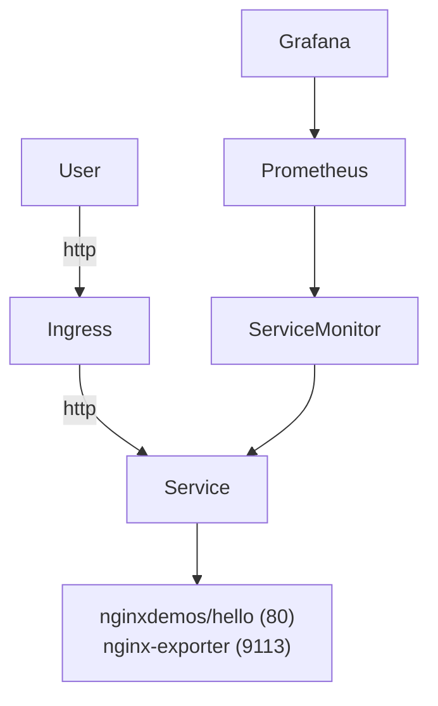

# Развёртывание приложения и системы мониторинга в Kubernetes используя Minikube (driver=docker)

Подробная пошаговая инструкция по запуску приложения **nginxdemos/hello** с мониторингом через **kube-prometheus-stack** (Prometheus, Grafana).

---

## 1. Установка Minikube и необходимых компонентов

[Install docker](https://docs.docker.com/engine/install/ubuntu/)

[Install helm](https://helm.sh/docs/intro/install/)

[Minikube install](https://kubernetes.io/ru/docs/tasks/tools/install-minikube/)

[Github Action](https://docs.github.com/en/actions/how-tos/hosting-your-own-runners/managing-self-hosted-runners/adding-self-hosted-runners)


### Linux / MacOS:

```bash
curl -LO https://storage.googleapis.com/minikube/releases/latest/minikube-linux-amd64
sudo install minikube-linux-amd64 /usr/local/bin/minikube
minikube status
kubectl config use-context minikube
minikube start --cpus=2 --memory=2038 --disk-size=10g --driver=docker
minikube addons enable ingress
minikube status
```

Проверить статус:

```bash
minikube status
```

---

## 2. Деплой приложения

Создаю namespace:

```bash
kubectl create namespace demo && kubectl create namespace kube-prometheus-stack
```
1.demo for apps 

2.For monitoring with Prometheus and Grafana

Применю манифест:

* deploy.yaml **
```bash
kubectl -n demo apply -f deploy.yaml
```

```yaml
apiVersion: apps/v1
kind: Deployment
metadata:
  name: hello
  labels:
    app: hello
spec:
  replicas: 1
  selector:
    matchLabels:
      app: hello
  template:
    metadata:
      labels:
        app: hello
      annotations:
        prometheus.io/scrape: "true"
        prometheus.io/port: "80"
        prometheus.io/path: "/metrics"
    spec:
      containers:
      - name: hello
        image: nginxdemos/hello:0.4-plain-text
        ports:
        - containerPort: 80
      - name: nginx-exporter
        image: nginx/nginx-prometheus-exporter:1.4
        args:
          - "-nginx.scrape-uri=http://127.0.0.1:80/metrics"
        ports:
        - name: metrics
          containerPort: 9113     
#
---
apiVersion: networking.k8s.io/v1
kind: Ingress
metadata:
  name: hello-ingress
  annotations:
    nginx.ingress.kubernetes.io/use-regex: "true"
    nginx.ingress.kubernetes.io/x-forwarded-for: "true"
spec:
  rules:
  - host: myown-website.com #Домен приложения по которому будет доступен  в браузере
    http:
      paths:
      - path: /
        pathType: Prefix
        backend:
          service:
            name: hello
            port:
              number: 80
---
apiVersion: v1
kind: Service
metadata:
  name: hello
  labels:
    app: hello
  annotations:  
    prometheus.io/scrape: "true"
    prometheus.io/path: "/"
    prometheus.io/port: "80"   
spec:
  selector:
    app: hello
  ports:
    - name: http       
      port: 80
      targetPort: 80
    - name: metrics
      port: 9113
      targetPort: 9113    
  type: ClusterIP
```


Следующим этапом добавил запись в `/etc/hosts`: для коректной работы DNS (local)

```bash
echo "$(minikube ip) myown-website.com" | sudo tee -a /etc/hosts
```

Проверил доступность:

```bash
curl http:// myown-website.com
```

Проверил заголовок `X-Real-IP`:

```bash
curl -H "X-Real-IP: 10.244.0.6" http://myown-website.com
```

---

## 3. Установка мониторинга (kube-prometheus-stack)
```bash
Предварительно я подготовил кластер тоесть созадл namespace `kube-prometheus-stack` - по факту  буду деплоится в этот неймспейс
Помимо того что будет задеплоен базовый стек мониторинга и визуализаци, также добавлю serviceMonitor (для скрейпинга метрик с apps)
```

```bash
helm repo add prometheus-community https://prometheus-community.github.io/helm-charts
helm repo update
helm install kube-prometheus-stack prometheus-community/kube-prometheus-stack --version 75.9.0 --namespace kube-prometheus-stack 
#Если нужно создать неймспейс то используем следующую команду
#helm install kube-prometheus-stack prometheus-community/kube-prometheus-stack --version 75.9.0 --namespace kube-prometheus-stack --create-namespace
Так как ми ранее уже создали заранее неймспейс то по сути выполняем только установку через пакетный менеджер helm
Он создает базовые компоненты для мониторинга такие как:
Компоненты:
- **[Prometheus](https://prometheus.io/)**  
  Система сбора метрик с мощным языком запросов (PromQL).Получает данные от экспортеров, node-exporter и других источников.

- **[Prometheus Operator](https://github.com/prometheus-operator/prometheus-operator)**  
  Управление Prometheus и Alertmanager через Kubernetes CRD (Custom Resources).

- **[Prometheus Node Exporter](https://github.com/prometheus/node_exporter)**  
  Сбор системных метрик с узлов кластера (CPU, память, диски, сеть и т.д.).

- **[kube-state-metrics](https://github.com/kubernetes/kube-state-metrics)**  
  Метрики состояния Kubernetes-объектов (Pods, Deployments, Nodes, PVC и т.д.).

- **[Alertmanager](https://github.com/prometheus/alertmanager)**  
  Обработка алертов от Prometheus и отправка уведомлений в Slack, Telegram, Email и другие каналы.

- **[Grafana](https://grafana.com/)**  
  Визуализация метрик, создание дашбордов, настройка алертов и интеграций.

- `ServiceMonitor`  
  Объект Custom Resource от **Prometheus Operator**, который указывает Prometheus, как находить и собирать метрики с сервисов в кластере.  
  Позволяет автоматически подключать `Service`'ы с нужными метками, без ручной настройки `scrape_config`.

```

---

## 📌 4. Настройка мониторинга приложения

Создать `servicemonitor.yaml`:

```yaml
apiVersion: monitoring.coreos.com/v1
kind: ServiceMonitor
metadata:
  name: hello-apps
  labels:
    release: kube-prometheus-stack #Эта метка используется для связи ресурса (например, `ServiceMonitor`) с экземпляром Prometheus, установленным через Helm chart **kube-prometheus-stack**. Prometheus Operator ищет объекты `ServiceMonitor` только с совпадающей меткой `release`, чтобы понять, какие метрики собирать.
spec:
  selector:
    matchLabels:
      app: hello  #Метка Service
  endpoints:
    - port: metrics #Имя порта из .spec.ports[*].name в Service
      path: /metrics #Путь к метрикам
      interval: 10s #Интервал сбора метрик   
  namespaceSelector: 
    matchNames: 
      - demo   #namespace где сам apps запущен
```
Добавляю servicemonitor
```bash
kubectl  -n kube-prometheus-stack  apply -f service_monitor_prom.yaml
```

kubectl -n kube-prometheus-stack  get events  (события для дальнейшего дебага если будут проблемы)
kubectl -n kube-prometheus-stack  get pod (посмотреть все ли нормально с самим преложение смотрим за обектами)

- `kubectl -n demo get svc`  
  **Service** — объект, обеспечивающий стабильный доступ к Pod'ам (по ClusterIP, NodePort или LoadBalancer). Используется для маршрутизации трафика внутри кластера или извне.

- `kubectl -n demo get ing`  
  **Ingress** — объект, управляющий HTTP(S)‑трафиком извне в кластер. Позволяет настраивать домены, правила маршрутизации и прокси.

- `kubectl -n demo get deployment`  
  **Deployment** — контроллер, который управляет созданием и обновлением ReplicaSet'ов и Pod'ов. Обеспечивает декларативний контроль над приложениями (rolling update, scale и т.д.).

```


```

---

## 🔎 5. Проверки работоспособности

**Проверка приложения (`/`):**
1)[<Приложение в браузрере>](./images/myown-website.com.png)
На этой картинке ми можем видеть что приложение работает

```bash
2)Дополнительно еще с помощью утилиты curl
curl http://myown-website.com
[<curl website>](./images/curl_to_web-site.png)
```
Ми убедились что само приложение работает и можна идти дальше 
**Проверка метрик (`/metrics`):**

Для того чтобы нормлаьно собирать метрики с приложение nginx, дополнительно к нему поставил sidecar container ,который собирает метрики 

```bash
- name: nginx-exporter
  image: nginx/nginx-prometheus-exporter:1.4
  args:
    - "-nginx.scrape-uri=http://127.0.0.1:80/metrics"
  ports:
  - name: metrics
    containerPort: 9113

```
```bash
NAME                     READY   STATUS    RESTARTS   AGE
hello-56586965cf-67vwg   2/2     Running   0          3h30m
```
Следующим этапом ми посмотри что все работает Экспортер который забирает данные с самого  приложени и что дание через сервис монитор корректно отображаются в Prometheus (Добавляю скрины)
[<Service-monitor>](./images/screen_service-monitor.png)
```bash
kubectl -n demo port-forward svc/hello 9113:9113
```
```bash
http://localhost:9113/metrics
```
[<Prome_exporter_nginx>](./images/screen_prome-exporter_localhost_9113.png)
Тут мы видим что все работает и нету ошыбок

**Проверка Prometheus (targets UP):**

```bash
kubectl -n kube-prometheus-stack port-forward svc/prometheus-operated 9090:9090
```
Тут ми увидем что приложение работает И оно через экспортер показывает метрики тут
тоесть ми убедились что связка з приложение->экспортер->Prometheus работает

[<Targets Prometheus>](./images/Targets-Prometheus_up.png)
```bash
http://localhost:9090/targets
```

Дальше нужно убедится что у нас `/metrics` `знает об приложении`
Тоесть это нужно для дальгейшего взаимодействие с приложение и мониторингом через Prometheus
Ми можем строить графики,таблицы в grafana и т д
```bash
http://localhost:9090/metrics
```
[<Metrics Prometheus>](./images/screen_metrics.png)

---

## 6. Архитектурная схема (Mermaid)




<pre>
+--------------------------+
|      GitHub Repo        |
|     + GitHub Actions    |
+-----------+-------------+
            |
            v
+--------------------------+
|     GitHub Workflow      |
|  (helm upgrade / apply)  |
+-----------+-------------+
            |
            v
+-----------------------------+
|     Minikube Kubernetes     |
|     (локальний кластер)     |
+-----------------------------+
            |
     +------+------+
     |             |
     v             v
+----------------+  +------------------------+
|  Deployment    |  |  Ingress Controller    |
|  hello-app     |  +------------------------+
|                |             |
|  +----------+  |             v
|  | Main App |  |       +-------------+
|  | (nginx   |  |       |   Service   |
|  |  hello)  |  |       +------+------+ 
|  +----------+  |              |
|  +-----------+ |              v
|  | Sidecar:  | |       +--------------+
|  | nginx     |<--------| Port: metrics |
|  | exporter  |         | (от sidecar)  |
|  +-----------+         +------+--------+
+----------------+              |
        |                       v
        |               +--------------+
        |               |ServiceMonitor|
        |               +------+-------+
        |                      |
        |                      v
        |               +--------------+
        |               |  Prometheus  |
        |               | (kube-stack) |
        |               +--------------+
</pre>


---

##  7. Команди для управление обектами  Minikube

| Команда                                        | Описание                       |
| ---------------------------------------------- | ------------------------------ |
| `kubectl -n demo get pods`                     | Список подов                   |
| `kubectl -n demo get ingress`                  | Просмотр Ingress               |
| `kubectl -n demo logs deploy/hello`            | Логи приложения                |
| `kubectl -n demo rollout restart deploy hello` | Перезапустить приложение       |
| `kubectl -n kube-prometheus-stack get pods`    | Состояние Prometheus Operator  |
